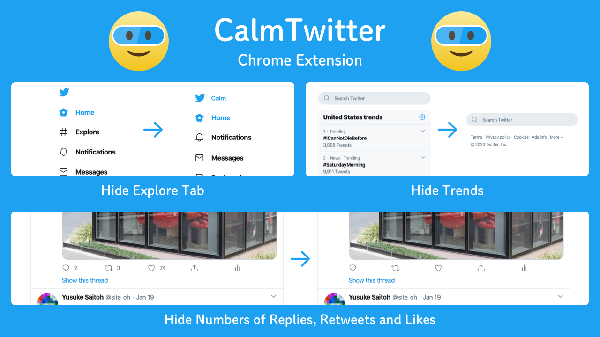

# Calm Twitter | おだやかTwitter

## Overview
This extension is a customized version of [calm-twitter](https://github.com/yusukesaitoh/calm-twitter) that I added some features for my personal use.
This extension hides trending information from twitter timelines to make your mind calm.

In addition to the original version, I have added following feature.
  - hide "retweets and quote retweets" and "favs" that appears with each tweets.
  - hide each activity counts by default

個人の事情のために yusukesaitoh 様の [おだやかTwitter](https://github.com/yusukesaitoh/calm-twitter) に機能を追加したものです。
この拡張機能はTwitterのタイムラインからトレンド情報を隠して、あなたの心を穏やかにしてくれます。

オリジナル版にたいして以下の要素を追加しています。
  - 各ツイートに対する「xx件のリツイートと引用リツイート」「xx件のいいね」を非常時に
  - 各アクティビティ数の表示を、デフォルトで非表示に

1. Hide "Explore" tab from the left column.
2. Hide trends and who to follow from the right column.
3. Hide numbers of replies, retweets, and likes.  They appear when you hover the mouse cursor on the tweet.
4. Show "Calm" next to the Twitter logo

## Requirement
This extension is developed using [Chrome Extension TypeScript Starter](https://github.com/chibat/chrome-extension-typescript-starter).

## License
Copyright (c) yusukesaitoh
Released under the MIT License
https://github.com/yusukesaitoh/calm-twitter