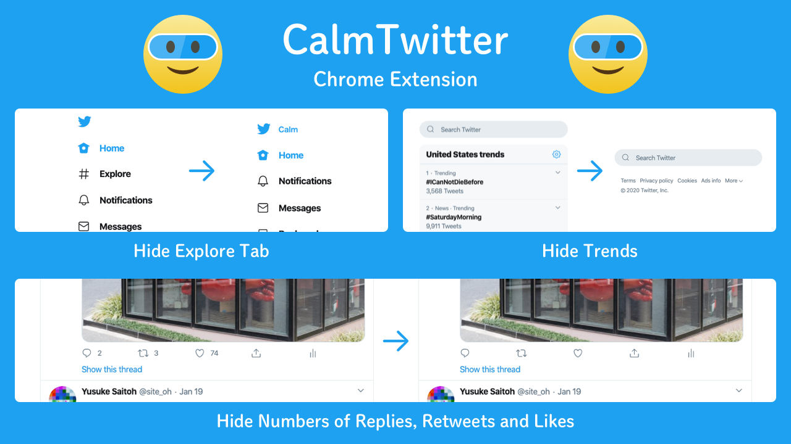

# Calm Twitter | おだやかTwitter

## Overview
This extension hides trending information from twitter timelines to make your mind calm.  
この拡張機能はTwitterのタイムラインからトレンド情報を隠して、あなたの心を穏やかにしてくれます。

- Hide unnecessary items from navigation
- Hide numbers of replies, retweets, likes, bookmarks, and view counts
- Hide trends, who to follow, subscribe prompts, and news from sidebar
- Hide following and follower counts
- Show "Calm" next to the logo

## Main Features (on by default)
- Hide trends, who to follow, subscribe prompts, and news from the right sidebar
- Hide numbers of replies, retweets, and likes (they appear when you hover)
- Hide view counts
- Hide "Explore" tab from navigation
- Show "Calm" next to the Twitter/X logo

## Additional Features (can be toggled in settings)

### Navigation
- Hide Grok
- Hide Jobs
- Hide Communities
- Hide Premium
- Hide Verified Organizations

### User Numbers
- Hide the number of following
- Hide the number of followers

### Tweet Interactions
- Hide reaction numbers even when hovering
- Hide reaction numbers in detail pages
- Hide Who to follow sections
- Hide Topics to follow sections

### Display
- Change Japanese font from Meiryo to Hiragino on Mac

## License
MIT License